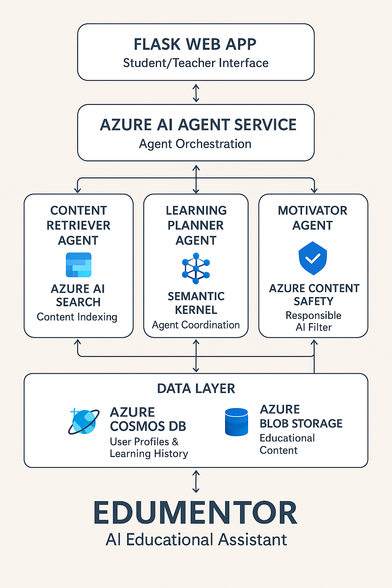

# EduMentor: AI-Powered Educational Assistant with Azure

Welcome to **EduMentor**, a Python-based AI agent built for the **AI Agents Hackathon** (Python track). This version integrates Azure Blob Storage for content storage and Azure Functions for agent processing, offering a scalable educational assistant with personalized study plans and motivational feedback.

## Features
- **Azure Blob Storage**: Stores educational content.
- **Azure Functions**: Runs Content Retriever, Learning Planner, and Motivator agents.
- **Web Interface**: Flask-based UI for students and teachers.

## Architecture
- **Frontend**: Flask web app.
- **Agents**: Hosted as Azure Functions (retrieveContent, generateStudyPlan, motivateUser).
- **Data**: Azure Blob Storage for resources.
- **Flow**: User input → Azure Functions → Response via web interface.



## Getting Started

### Prerequisites
- Python 3.8 or higher
- Azure subscription (for deployment)
- Azure CLI (optional, for setup)

### Installation
1. **Set Up Environment**:
   - Create a `.env` file with:
     ```
     AZURE_FUNCTION_ENDPOINT=https://yourfunctionapp.azurewebsites.net/api
     AZURE_BLOB_STORAGE_URL=https://yourstorageaccount.blob.core.windows.net/content
     AZURE_BLOB_SAS_TOKEN=your_sas_token
     ```
   - Replace values with your Azure details after deployment.
2. **Install Dependencies**:
   ```bash
   pip install -r requirements.txt
   ```
3. **Deploy to Azure** (see deploy_azure.sh):
   - Follow the script to set up Azure resources.
4. **Run Locally (Simulation)**:
   - Set `AZURE_FUNCTION_ENDPOINT` to a local test URL (e.g., `http://localhost:7071/api`) if testing without deployment.
   - Run: `python app.py`
   - Open `http://localhost:5000`.

## Project Structure
```
EduMentor/
├── app.py                  # Core application logic
├── README.md               # Project documentation
├── requirements.txt        # Python dependencies
├── deploy_azure.sh         # Azure setup script
├── templates/
│   ├── index.html          # Student interface
│   ├── admin.html          # Teacher interface
├── tests/
│   ├── test_app.py         # Unit tests
├── data/                   # Placeholder for local testing
├── agents/                 # Placeholder for agent code (to be deployed as Functions)
├── architecture_diagram.png # Architecture diagram (placeholder)
├── demo_video.mp4          # Demo video (placeholder)
├── LICENSE                 # Project license
```

## Testing
Run unit tests to verify functionality:
```bash
python -m unittest discover tests
```

## Contributing
Suggestions are welcome! Open an issue or submit a pull request.

## License
MIT License. See [LICENSE](LICENSE) for details.